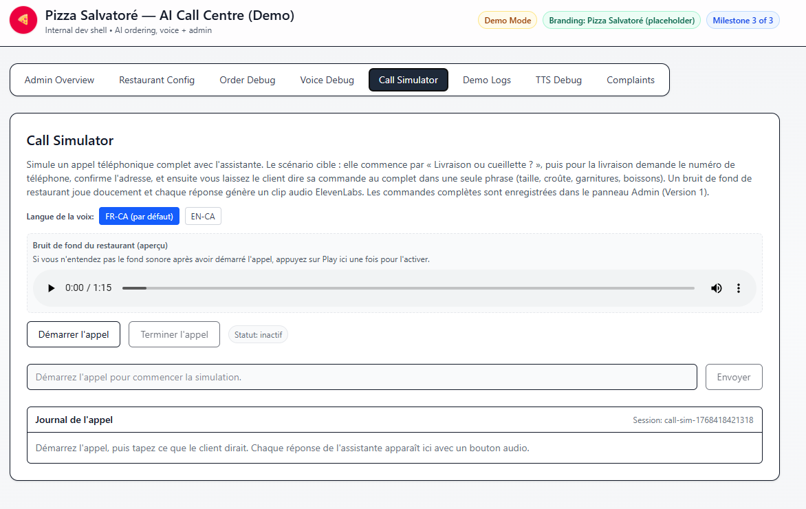
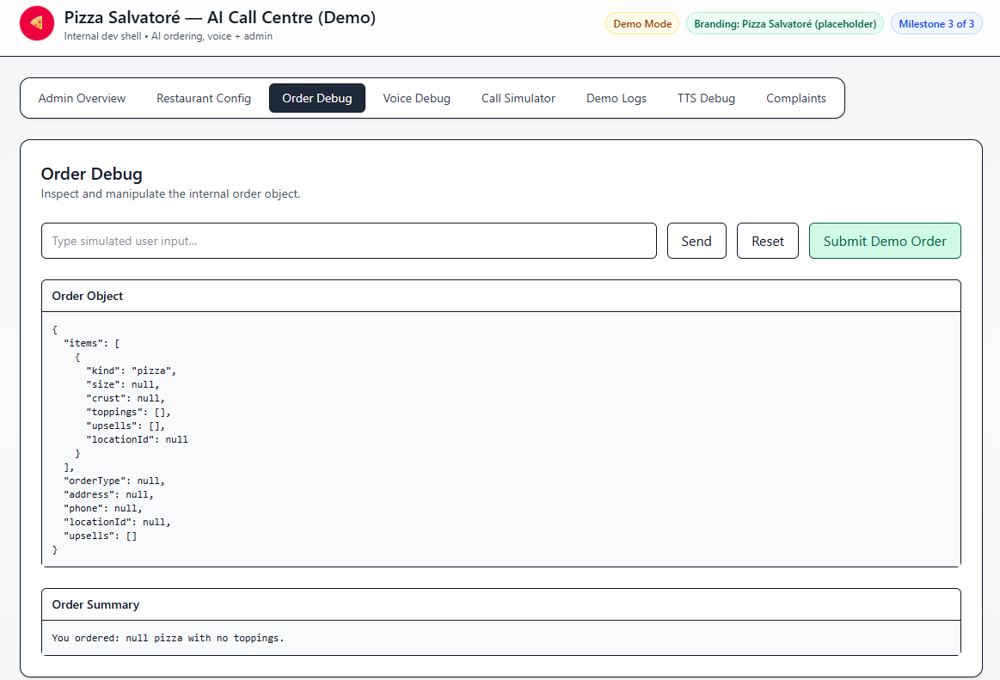
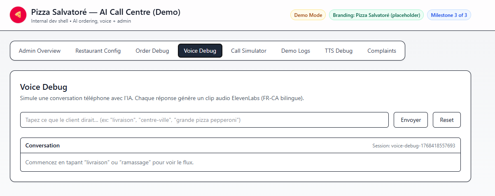

# AI Restaurant Call Center (French-Canadian)

A custom-built, white-label foundation for an AI-powered restaurant phone ordering experience — designed to behave like a real call center, not a chatbot.

This project was intentionally built **without a generative conversation dependency**. Instead, it uses a deterministic state machine to ensure reliability, auditability, and predictable outcomes in a production ordering environment.

---

## Why this architecture

In real restaurant operations, missed orders, ambiguous confirmations, or unpredictable AI responses are expensive.
This system was designed around that reality.

**Core design goals:**

* Deterministic behavior over probabilistic responses
* Clear correction paths when users change their mind mid-order
* Debuggability first (engine state, order object, audio output)
* Demo-safe by default — no real orders or phone calls required

---

## What this project demonstrates

### Conversation & Order Design

* A custom conversation engine ("Turbo") that:

  * Guides users through delivery vs pickup
  * Collects size, crust, toppings, and upsells
  * Handles corrections naturally ("Actually, change the crust…")
  * Produces a normalized order object suitable for downstream systems

### Voice & Call Experience

* French-Canadian TTS pipeline via ElevenLabs
* Per-message voice handling with realistic pacing
* Optional background restaurant ambience to simulate real calls

### Developer Tooling

* **Order Debug** — inspect conversation state and order structure live
* **Voice Debug** — generate and review TTS output per turn
* **Call Simulator** — full in-browser phone-call simulation with state tracking

---

## Key routes

* `/order-debug` — test and inspect the conversation + order object
* `/voice-debug` — review generated audio per assistant message
* `/call-simulator` — simulate a full customer call with ambience

---

## Tech stack

* Vite + React
* Node.js
* Tailwind
* ElevenLabs (TTS via environment variables)

---

## Running locally

```bash
npm install
npm run dev
```

Create a `.env` file using `.env.example` and provide your own TTS credentials.

---

## Notes

This repository is intentionally **brand-agnostic** and **client-safe**.
It focuses on system design, reliability, and real-world constraints rather than UI polish or restaurant-specific data.

The goal was not to build a demo chatbot —
but a foundation that could realistically sit behind a phone number.

---

## Preview

### Call Simulator


### Order Debug Tool


### Voice Debug

